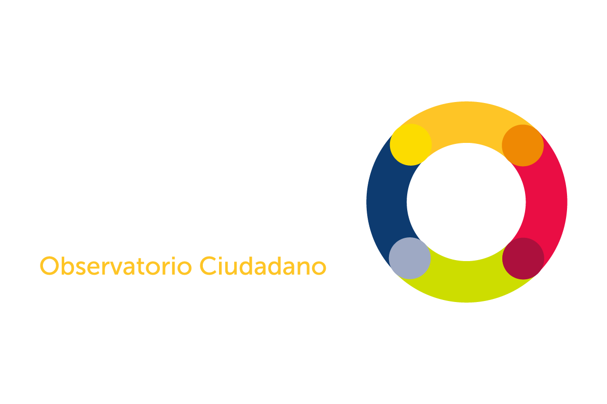
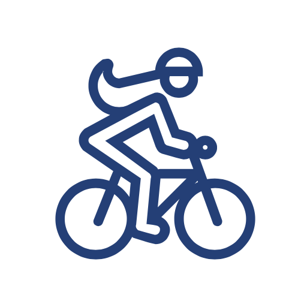
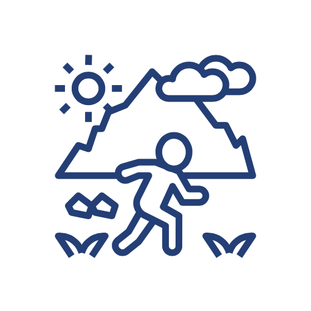
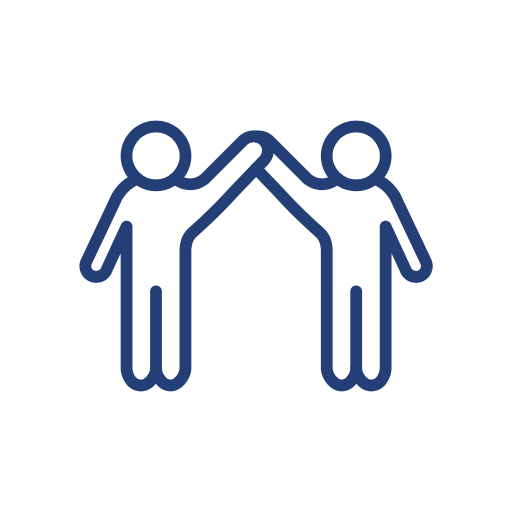

  <body>
    <main role="main">

      <section class="jumbotron text-center">
        

          

            

          <h4 class="text-white jumbotron-heading">Plataforma Interactiva de la Séptima Encuesta de Percepción Ciudadana sobre Calidad de Vida 2020</h4>
     
          
   

          
          

            

          
La felicidad y satisfacción de las y los tapatíos está definida por sus vivencias en el Área Metropolitana de Guadalajara. Cada dos años, Jalisco Cómo Vamos realiza una encuesta de percepción ciudadana para conocer la calidad de vida de quiénes habitan los municipios de El Salto, Tonalá, San Pedro Tlaquepaque, Tlajomulco de Zúñiga, Guadalajara y Zapopan. En esta plataforma se encuentran los resultados de la <a href="bit.ly/epc-2020">Séptima Encuesta de Percepción Ciuadana sobre Calidad de Vida 2020</a>, disponible en un formato virtual que permite interactuar con los datos de manera específica e interactiva.

          
              

              
Actualización febrero 2022

              
La visualización de los datos ahora incluye la opción de filtrar la información por municipios, además de mostrar los resultadoss del conjunto global del AMG.

            
            
   

          

            <a class="smooth" href="#informacion" class="btn btn-primary my-2">Conoce la plataforma</a>
          

        

      </section>
<!-- start info -->
           

      

         

           

         <lord-icon
    src="https://cdn.lordicon.com/jvucoldz.json"
    trigger="loop"
    colors="primary:#545454,secondary:#ed8189"
    style="width:180px;height:180px">
</lord-icon>
            

            <h2>Navega</h2>
            
Los resultados de la encuesta se encuentran agrupados por secciones, y las secciones se componen de varias temáticas de nuestra encuesta.

           
<a class="btn btn-secondary" href="#tematicas" role="button">Consulta las temáticas</a>

          
<!-- /.col-lg-4 -->
          

           
<lord-icon
    src="https://cdn.lordicon.com/pndvzexs.json"
    trigger="loop"
    colors="primary:#ed8189,secondary:#545454"
    style="width:180px;height:180px">
             </lord-icon>

            <h2>Interactúa</h2>
            
Navega e interactua con los resultados de la <a blank="_target" href="bit.ly/epc-2020">Séptima Encuesta de Percepción Ciudadana sobre Calidad de Vida 2020</a>.  Conoce la plataforma y genera tus propias visualizaciones.

           
<a class="btn btn-secondary" href="guia-de-uso.html" role="button">Guía de uso</a>

          
<!-- /.col-lg-4 -->
          

           

             <lord-icon
    src="https://cdn.lordicon.com/wcjauznf.json"
    trigger="loop"
    colors="primary:#ed8189,secondary:#545454"
    style="width:180px;height:180px">
</lord-icon>
            

            <h2>Descarga</h2>
            
Comparte los resultados que más te interesan en tus documentos, reportajes, investigaciones o redes sociales.  Descarga nuestra base de datos. 

            
<a class="btn btn-secondary" target="_blank" href="http://jaliscocomovamos.org/datos-abiertos" role="button">Consulta nuestros datos abiertos</a>

          
<!-- /.col-lg-4 -->
         
        
<!-- /.row -->
      
<!-- /.container --> 
 <!-- close info -->     
      
      

        

          

            

            <h2>Consulta las temáticas</h2>
          

                

          

            

              

                
                

                  
Bienestar subjetivo
 
                  

                    

                      <a href="bienestar-subjetivo.html"><button type="button" class="btn btn-sm btn-outline-secondary">Consultar datos</button></a>
                    

               
                  

                

              

            

            
            

              

                
                

                  
Movilidad
 
                  

                    

                      <a href="movilidad.html"><button type="button" class="btn btn-sm btn-outline-secondary">Consultar datos</button></a>
                    

               
                  

                

              

            

                  
            

              

                
                

                  
Educación, cultura, recreación y vivienda

                  

                    

                      <a href="educacion-cultura-recreacion-vivienda.html"><button type="button" class="btn btn-sm btn-outline-secondary">Consultar datos</button></a>
                    

               
                  

                

              

            

                  
            

              

                
                

                  
Gobierno
 
                  

                    

                      <a href="gobierno.html"><button type="button" class="btn btn-sm btn-outline-secondary">Consultar datos</button></a>
                    

                  

                

              

            

            
            

              

                
                

                  
Salud
 
                  

                    

                      <a href="salud.html"><button type="button" class="btn btn-sm btn-outline-secondary">Consultar datos</button></a>
                    

                  

                

              

            

            
                   

              

                
                

                  
Relaciones personales y economía

                  

                    

                      <a href="relaciones-interpersonales-economia.html"><button type="button" class="btn btn-sm btn-outline-secondary">Consultar datos</button></a>
                    

                  

                

              

            

            
                     

              

                
                

                  
Seguridad y medio ambiente
 
                  

                    

                      <a href="seguridad-medio-ambiente.html"><button type="button" class="btn btn-sm btn-outline-secondary">Consultar datos</button></a>
                    

                  

                

              

            

            
                     

              

                
                

                  
Ciudadanía
 
                  

                    

                      <a href="ciudadania.html"><button type="button" class="btn btn-sm btn-outline-secondary">Consultar datos</button></a>
                    

                  

                

              

            

            
            

<!--
           
-->

          

        

      

    </main>
  
  

