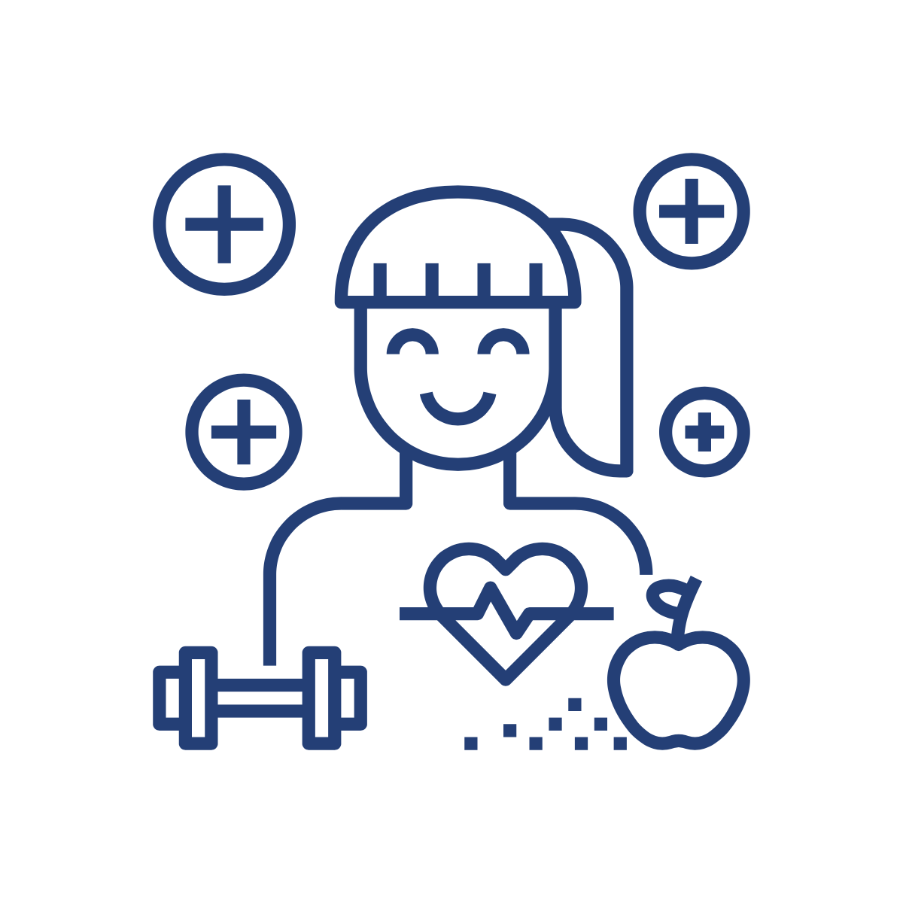

  <body>
    <main role="main">

      <section class="jumbotron text-center">
        

          <h1 class="text-white jumbotron-heading">Séptima Encuesta de Percepción Ciudadana sobre Calidad de Vida 2020</h1>
          
          
Cada dos años salimos a preguntarle a las y  los tapatíos cómo se sienten con su calidad de vida. En nuestras encuestas de percepción se lee la historia de lo que nos han ido contando.

          
Esta plataforma presenta los resultados de la encuesta 2020 para su consulta digital.  En la parte superior derecha podrás visualizar los resultados por tema.

          

            <a href="https://bit.ly/epc-2020" target="_blank" class="btn btn-primary my-2">Descarga la publicación digital de la Encuesta 2020</a>
          

        

      </section>

      
      
      

        

          

            <h3 class="text-center center-text">Consulta por temáticas</h3>
            

              

                
                

                  
Bienestar subjetivo

                  

                    

                      <a href="bienestar-subjetivo.html"><button type="button" class="btn btn-sm btn-outline-secondary">Consultar datos</button></a>
                    

               
                  

                

              

            

            
            

              

                
                

                  
Movilidad

                  

                    

                      <a href="movilidad.html"><button type="button" class="btn btn-sm btn-outline-secondary">Consultar datos</button></a>
                    

               
                  

                

              

            

                  
            

              

                
                

                  
Educación, cultura, recreación y vivienda

                  

                    

                      <a href="educacion-cultura-recreacion-vivienda.html"><button type="button" class="btn btn-sm btn-outline-secondary">Consultar datos</button></a>
                    

               
                  

                

              

            

                  
            

              

                
                

                  
Gobierno

                  

                    

                      <a href="gobierno.html"><button type="button" class="btn btn-sm btn-outline-secondary">Consultar datos</button></a>
                    

                  

                

              

            

            
                   

              

                
                

                  
Relaciones personales y economía

                  

                    

                      <a href="relaciones-interpersonales-economia.html"><button type="button" class="btn btn-sm btn-outline-secondary">Consultar datos</button></a>
                    

                  

                

              

            

            
                     

              

                
                

                  
Seguridad y medio ambiente

                  

                    

                      <a href="seguridad-medio-ambiente.html"><button type="button" class="btn btn-sm btn-outline-secondary">Consultar datos</button></a>
                    

                  

                

              

            

            
                     

              

                
                

                  
Ciudadanía

                  

                    

                      <a href="ciudadania.html"><button type="button" class="btn btn-sm btn-outline-secondary">Consultar datos</button></a>
                    

                  

                

              

            

            
            

<!--
           
-->

          

        

      

    </main>
