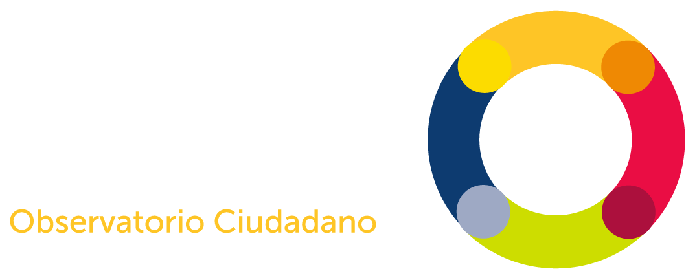

  <body>
    <main role="main">

      <section class="jumbotron text-center">
        

          <h1 class="text-white jumbotron-heading">Plataforma Interactiva de la Séptima Encuesta de Percepción Ciudadana sobre Calidad de Vida 2020</h1>
          
          
La felicidad y satisfacción de las y los tapatíos está definida por sus vivencias en el Área Metropolitana de Guadalajara. 

          
Queremos conocer las motivaciones, preocupaciones, miedos y estilo de vida de quienes habitan los municipios de El Salto, Tonalá, San Pedro Tlaquepaque, Tlajomulco de Zúñiga, Guadalajara y Zapopan, y por eso cada dos años salimos a preguntarles cómo viven la ciudad y cómo sienten su calidad de vida. Las historias que cuentan han quedado plasmadas en nuestras Encuestas de Percepción. 

          
En esta plataforma interactiva presentamos una nueva manera de interactuar con los resultados de las encuestas de percepción, y aquí se podrán encontrar los resultados de la <a href="bit.ly/epc-2020">Séptima Encuesta de Percepción Ciuadana sobre Calidad de Vida 2020</a>.
 
          
¿Cómo se sienten las y los tapatíos con su vida? ¿Son felices? 

          

            <a href="#informacion" target="_blank" class="btn btn-primary my-2">Más información</a>
          

        

      </section>
<!-- start info -->
           

      

          

           
<lord-icon
    src="https://cdn.lordicon.com/pndvzexs.json"
    trigger="loop"
    colors="primary:#ed8189,secondary:#545454"
    style="width:250px;height:250px">
             </lord-icon>

            <h2>Interactúa</h2>
            
Navega e interactua con los resultados de la <a blank="_target" href="bit.ly/epc-2020">Séptima Encuesta de Percepción Ciudadana sobre Calidad de Vida 2020</a>. Conoce la plataforma y genera tus propias visualizaciones.

           
<a class="btn btn-secondary" href="guia-de-uso.html" role="button">Guía de uso</a>

          
<!-- /.col-lg-4 -->
          

           

             <lord-icon
    src="https://cdn.lordicon.com/wcjauznf.json"
    trigger="loop"
    colors="primary:#ed8189,secondary:#545454"
    style="width:250px;height:250px">
</lord-icon>
            

            <h2>Descarga</h2>
            
Descarga las visualizaciones en archivos formato PDF o PNG. Visita nuestra <a target="_blank" href="http://jaliscocomovamos.org/datos-abiertos">base de datos en nuestro sitio oficial</a>.

            
<a class="btn btn-secondary" href="#" role="button">Consulta nuestros datos abiertos</a>

          
<!-- /.col-lg-4 -->
          

           

             <lord-icon
    src="https://cdn.lordicon.com/koyivthb.json"
    trigger="loop"
    colors="primary:#545454,secondary:#ed8189"
    style="width:250px;height:250px">
</lord-icon>
            

            <h2>Comparte</h2>
            
Los resultados que más te interesan en tus documentos, reportajes, investigaciones o redes sociales.

           
<a class="btn btn-secondary" href="#" role="button">Comparte</a>

          
<!-- /.col-lg-4 -->
        
<!-- /.row -->
      
<!-- /.container --> 
 <!-- close info -->     
      
      

        

          

            <h3 class="text-center center-text">Consulta por temáticas</h3>
          

          

            

              

                
                

                  
Bienestar subjetivo

                  

                    

                      <a href="bienestar-subjetivo.html"><button type="button" class="btn btn-sm btn-outline-secondary">Consultar datos</button></a>
                    

               
                  

                

              

            

            
            

              

                
                

                  
Movilidad

                  

                    

                      <a href="movilidad.html"><button type="button" class="btn btn-sm btn-outline-secondary">Consultar datos</button></a>
                    

               
                  

                

              

            

                  
            

              

                
                

                  
Educación, cultura, recreación y vivienda

                  

                    

                      <a href="educacion-cultura-recreacion-vivienda.html"><button type="button" class="btn btn-sm btn-outline-secondary">Consultar datos</button></a>
                    

               
                  

                

              

            

                  
            

              

                
                

                  
Gobierno

                  

                    

                      <a href="gobierno.html"><button type="button" class="btn btn-sm btn-outline-secondary">Consultar datos</button></a>
                    

                  

                

              

            

            
                   

              

                
                

                  
Relaciones personales y economía

                  

                    

                      <a href="relaciones-interpersonales-economia.html"><button type="button" class="btn btn-sm btn-outline-secondary">Consultar datos</button></a>
                    

                  

                

              

            

            
                     

              

                
                

                  
Seguridad y medio ambiente

                  

                    

                      <a href="seguridad-medio-ambiente.html"><button type="button" class="btn btn-sm btn-outline-secondary">Consultar datos</button></a>
                    

                  

                

              

            

            
                     

              

                
                

                  
Ciudadanía

                  

                    

                      <a href="ciudadania.html"><button type="button" class="btn btn-sm btn-outline-secondary">Consultar datos</button></a>
                    

                  

                

              

            

            
            

<!--
           
-->

          

        

      

    </main>
